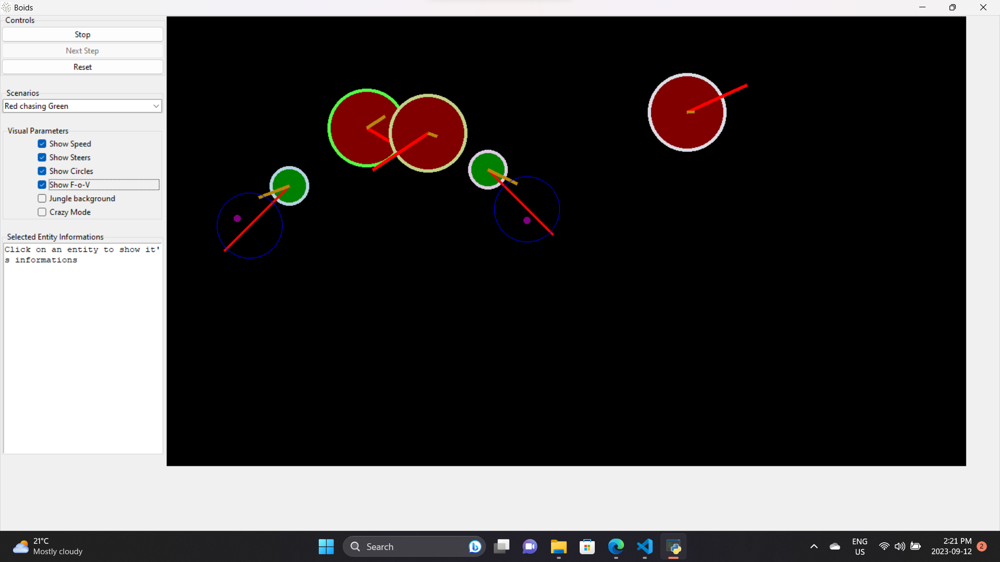
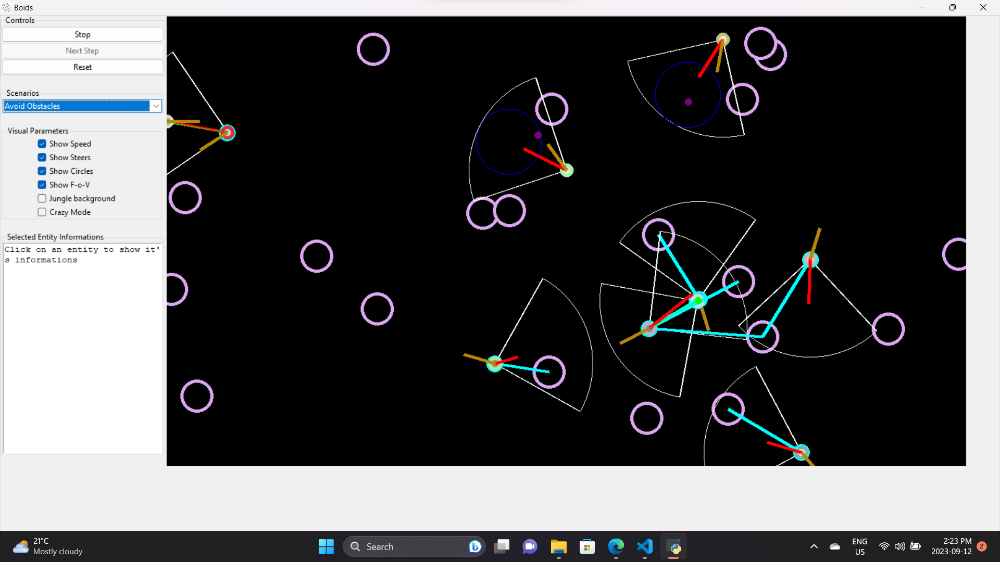
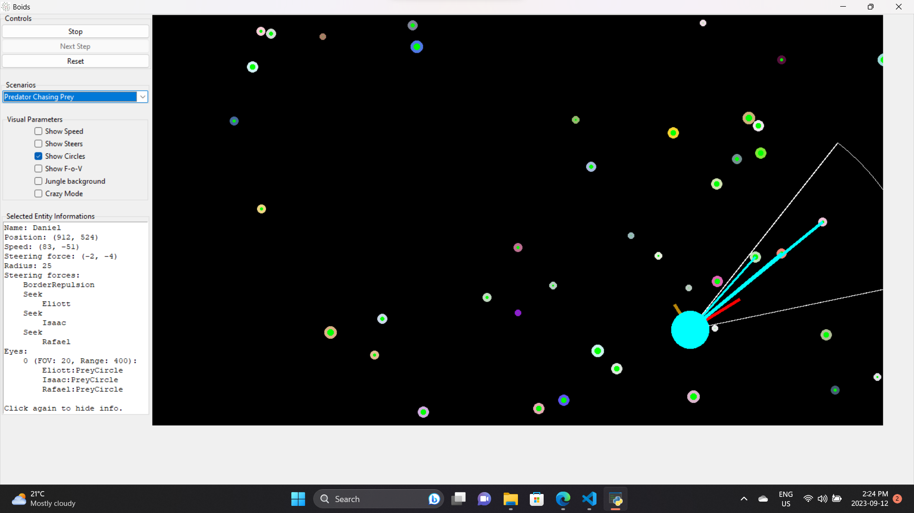
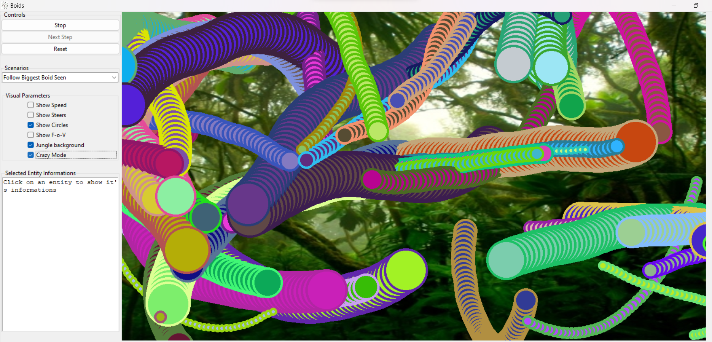

<a name="readme-top"></a>

### This project was init from [this project](https://github.com/cryptoblivious/Boids) as part of this amazing team [JAAT](https://github.com/cryptoblivious/Boids/graphs/contributors)

<div align="center">


<h1 align="center">Boids</h1>

  <p align="center">
    A 2D flocking simulation offering different scenarios and steering behaviours.
  </p>
</div>


<!-- TABLE OF CONTENTS -->
<details>
  <summary>Table of Contents</summary>
  <ol>
    <li>
      <a href="#about-the-project">About The Project</a>
      <ul>
        <li><a href="#built-with">Built With</a></li>
      </ul>
    </li>
    <li><a href="#usage">Usage</a></li>
    <li><a href="#contact">Contact</a></li>
    <li> 
  </ol>
</details>


<!-- ABOUT THE PROJECT -->
## About The Project
  <p align="justify">
    This project is a boids flocking simulation designed to demonstrate various steering behaviors. Using behaviors like seek, wander, flee, repulsion, and more, we've set up scenarios including predator-prey dynamics, follow-the-leader sequences, obstacle avoidance, and the concept of rising sentience.
  </p>
  <p align="justify">
   Boids can be equipped with a field of view, allowing them to interact with and respond to other nearby boids. The interface provides users with the ability to pause (freeze) the simulation, then advance it step-by-step. This granular control, combined with checkboxes, lets users select specific elements they'd like drawn on the screen, ensuring a tailored visualization experience.
  </p>
   <p align="justify">
   The simulation runs against the backdrop of a lush jungle environment, which adds depth to the overall aesthetic.
   For those looking for an extra twist, there's a "crazy mode" where the boids are very persistent. The project was built using the Pillow and Tkinter libraries, ensuring a blend of detailed visuals and a user-friendly interactive interface.
  </p>


<p align="right">(<a href="#readme-top">back to top</a>)</p>


### Built With

[![VSCode][vscode-img]][vscode-url]
[![Python][python-img]][python-url]


<!-- USAGE EXAMPLES -->
## Usage

### Prerequisites

You need to have python installed, if not you can download it here: [https://www.python.org/downloads/](https://www.python.org/downloads/)

### Installation

1. Clone the repo
   ```sh
   git clone "https://github.com/Jon-Robb/Boids.git"
   cd Boids
    ```
2. Install pillow
   ```sh
   pip install pillow
   ```
3. Run the program
   ```sh
    python boids.py
    ```
    </br>


<p align="right">(<a href="#readme-top">back to top</a>)</p>


<br/>
<h3 align="center"> Entry Screen </h3>
<p align="center">
  
</p>
<br/>
<h3 align="center"> See all forces and field of view </h3>
<p align="center">
  
</p>
<br/>
<h3 align="center"> Click on a boid to see its stats and forces </h3>
<p align="center">
  
</p>
<br/>
<h3 align="center"> Get a little cray cray </h3>
<p align="center">
  
</p>
<br/>


<p align="right">(<a href="#readme-top">back to top</a>)</p>


<!-- CONTACT -->
## Contact

[![LinkedIn][linkedin-shield]][linkedin-url] 
[![Gmail][gmail-shield]][gmail-url]
[![Portfolio][portfolio-shield]][portfolio-url]


<p align="right">(<a href="#readme-top">back to top</a>)</p>


<!-- MARKDOWN LINKS & IMAGES -->
<!-- https://www.markdownguide.org/basic-syntax/#reference-style-links -->
<!-- images -->
[linkedin-shield]: https://img.shields.io/badge/-LinkedIn-black.svg?style=for-the-badge&logo=linkedin&colorB=555
[linkedin-url]: https://linkedin.com/in/jonathan-robinson-187716274
[gmail-shield]:	https://img.shields.io/badge/Gmail-D14836?style=for-the-badge&logo=gmail&logoColor=white
[gmail-url]: mailto:robinsonjonathan240817@gmail.com
[portfolio-shield]:https://img.shields.io/badge/website-000000?style=for-the-badge&logo=About.me&logoColor=white
[portfolio-url]: https://jonrobinson.ca


<!-- built with  -->
[vscode-img]: https://img.shields.io/badge/vs%20code-007ACC?style=for-the-badge&logo=visual-studio-code&logoColor=white
[vscode-url]: https://code.visualstudio.com/
[python-img]: https://img.shields.io/badge/python-3776AB?style=for-the-badge&logo=python&logoColor=white
[python-url]: https://www.python.org/
[pillow-img]: https://img.shields.io/badge/pillow-3776AB?style=for-the-badge&logo=python&logoColor=white
[pillow-url]: https://pillow.readthedocs.io/en/stable/